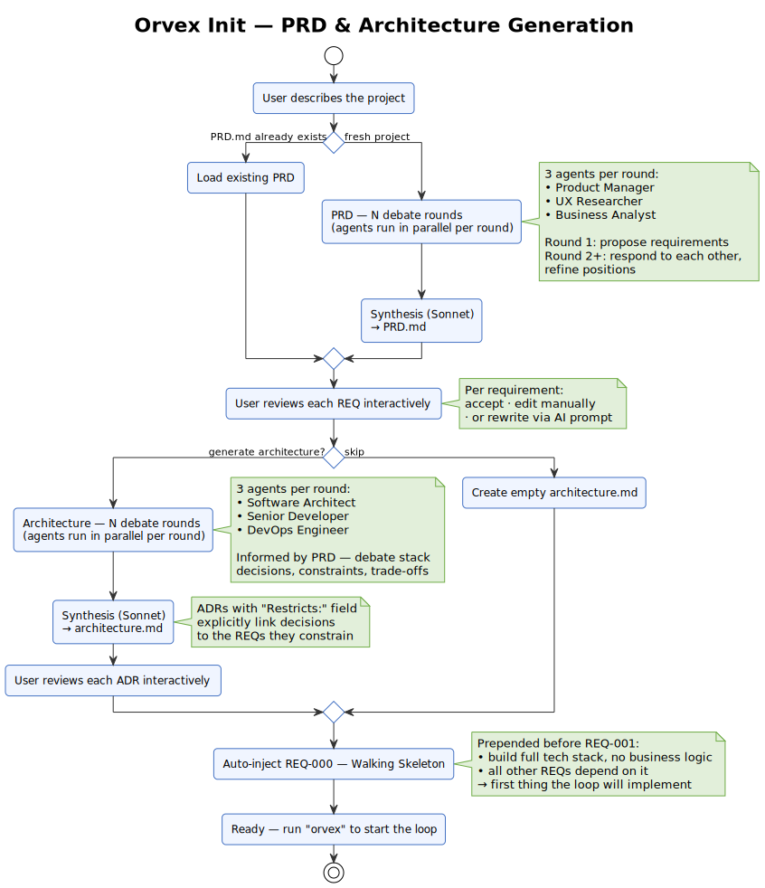
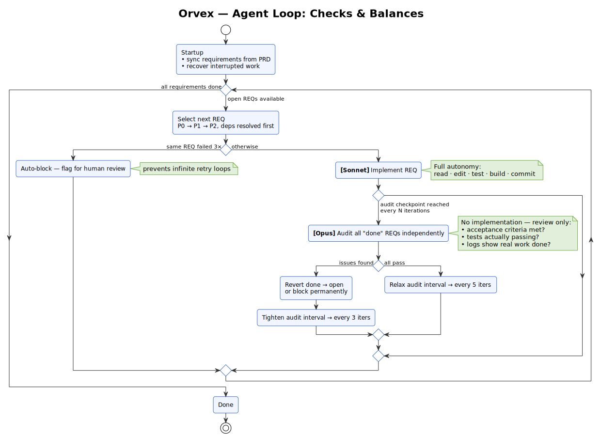

# Orvex

Autonomous AI agent framework for PRD-driven software development.

Orvex orchestrates Claude Code to implement requirements iteratively — one REQ per loop iteration — while a real-time TUI dashboard keeps you in control.

```
orvex init        # generate PRD + architecture interactively
orvex             # start the loop
```

---

## How it works

### `orvex init`

You describe your project. Three specialized agents (Product Manager, UX Researcher, Business Analyst) debate requirements across multiple rounds, then a synthesis model distills the discussion into a structured `PRD.md`. The same debate-and-synthesize pattern produces `architecture.md` via a second panel of agents (Software Architect, Senior Developer, DevOps Engineer). You review and edit both interactively before anything gets built. A **Walking Skeleton** REQ is automatically prepended — it sets up the full tech stack first and every other REQ depends on it.



### `orvex` (loop)

`loop_dev.sh` picks the next open requirement in priority order, calls Claude Sonnet to implement it, verifies the result (build + tests + linter), and commits. Every N iterations Claude Opus independently audits all completed requirements and can revert them if they fail. Built-in safeguards prevent the loop from getting stuck or producing phantom progress.



### TUI

`orvex-tui` renders a live dashboard with progress bars, a cost-tracked activity feed, and keyboard controls (pause / skip / edit context / quit).

```
orvex
 ├─ spawns loop_dev.sh  (background)
 └─ launches orvex-tui  (foreground)
       │
       ├─ polls  .agent/status.json       (REQ progress)
       ├─ reads  .agent/iterations.jsonl  (events)
       └─ sends  .agent/control.fifo      (p / s / e / q)
```

---

## Prerequisites

| Tool | Purpose |
|------|---------|
| [Claude Code CLI](https://docs.anthropic.com/claude-code) (`claude`) | AI agent execution |
| [Deno](https://deno.land) ≥ 2 | Build the TUI binary |
| `bash`, `jq`, `git` | Loop orchestration |

---

## Install

```bash
curl -fsSL https://raw.githubusercontent.com/berndheidemann/orvex/main/get.sh | bash
```

Clones the repo to `~/.local/share/orvex`, builds the TUI binary, and symlinks `orvex` into `~/.local/bin`.

```bash
# Optional: custom locations
ORVEX_HOME=~/tools/orvex PREFIX=~/.local \
  curl -fsSL https://raw.githubusercontent.com/berndheidemann/orvex/main/get.sh | bash
```

**Manual install**

```bash
git clone https://github.com/berndheidemann/orvex.git
cd orvex
deno task build
./install.sh                    # → /usr/local/bin/orvex  (needs sudo)
./install.sh --prefix ~/.local  # → ~/.local/bin/orvex
```

---

## Quick start

```bash
cd my-project
orvex init
```

This guides you through generating `PRD.md` and `architecture.md`. Review and adjust the generated files, then:

```bash
orvex
```

The loop starts. The TUI shows live progress.

---

## PRD format

Requirements live in `PRD.md` and follow this structure:

```markdown
### REQ-001: Walking Skeleton
- **Status:** open
- **Priority:** P0
- **Size:** S
- **Depends on:** ---

#### Description
Minimal runnable project scaffold.

#### Acceptance Criteria
- [ ] `npm run dev` starts without errors
- [ ] Health endpoint returns 200
```

**Status values:** `open` → `in_progress` → `done` | `blocked`
**Priority:** `P0` (must-have) · `P1` (important) · `P2` (nice-to-have)
**Size:** `S` (small, may be batched) · `M` (medium, gets an Opus planning phase)

Dependencies are respected — a REQ only starts when all `Depends on` entries are `done`.

---

## Keyboard controls

| Key | Action |
|-----|--------|
| `p` | Pause / resume loop |
| `s` | Skip current REQ |
| `e` | Edit `.agent/context.md` inline |
| `q` | Quit |

---

## Configuration

Environment variables for `loop_dev.sh`:

| Variable | Default | Description |
|----------|---------|-------------|
| `ITER_TIMEOUT` | `1800` | Hard timeout per iteration (seconds) |
| `IDLE_TIMEOUT` | `900` | Kill iteration if no output for N seconds |
| `SAFE_BRANCH` | `1` | Auto-create a dedicated agent branch |
| `SANDBOX_MODE` | `0` | Skip environment checks |
| `FULL_VERIFY` | `0` | Force full E2E verification every iteration |
| `REFACTOR` | `0` | Run one-time Opus refactoring review instead of loop |

```bash
IDLE_TIMEOUT=300 ./loop_dev.sh 5   # max 5 iterations, 5 min idle limit
REFACTOR=1 ./loop_dev.sh           # generate .agent/refactor-backlog.md
```

---

## Agent files

Orvex stores runtime state in `.agent/` inside your project:

| File | Purpose |
|------|---------|
| `status.json` | Authoritative REQ status (machine-written) |
| `context.md` | Context injected into every iteration (rewritten each time, max 50 lines) |
| `architecture.md` | Architecture decisions — append-only ADRs |
| `learnings.md` | Persistent insights — append-only |
| `iterations.jsonl` | Event stream consumed by the TUI |
| `logs/iter-*.jsonl` | Per-iteration detail logs |

---

## Multi-model setup

| Model | Role |
|-------|------|
| Claude Sonnet | Implementation (every iteration) |
| Claude Opus | Planning (M-sized REQs) · Validation (every 5 iterations) · Refactoring review |
| Claude Haiku | Content quality review (optional) |

---

## Development

```bash
deno task dev    # run TUI without compiling
deno task build  # compile → orvex-tui
deno task check  # type-check
deno task test   # run tests
```

---

## License

MIT
